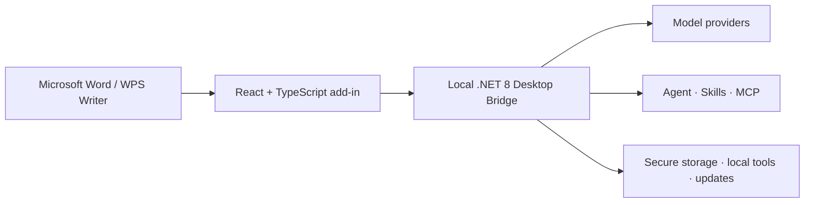

<p align="center">
  
</p>

<h1 align="center">WordOllama.JS</h1>

<p align="center">
  A local-first AI workspace for Microsoft Word and WPS Writer.<br>
  One React interface, one cross-platform Desktop Bridge, and your choice of models.
</p>

<p align="center">
  <strong>English</strong> · <a href="README.zh-CN.md">简体中文</a>
</p>

<p align="center">
  <a href="LICENSE"></a>
  
  
  
  
</p>

<p align="center">
  <a href="https://wordollama.com">Website</a> ·
  <a href="docs/USER_GUIDE.en-US.md">User guide</a> ·
  <a href="https://github.com/ByronLeeeee/wordollama.js/issues">Issues</a> ·
  <a href="CONTRIBUTING.md">Contributing</a>
</p>

---

WordOllama.JS brings writing, review, translation, document automation, and
agentic workflows into Word and WPS. It supports local models such as Ollama and
llama.cpp as well as OpenAI-compatible endpoints, Claude, Gemini, and other
configured providers.

The desktop edition is self-hosted on the user's machine. A .NET 8 Desktop
Bridge serves the React interface and local API, while handling providers, MCP,
Skills, local tools, secure storage, and update verification. End users do not
need Vite or a terminal after installing a packaged build.

> Looking for the legacy COM/VSTO edition? See
> [`wordollama-community`](https://github.com/ByronLeeeee/wordollama-community).

## Highlights

| Area | What it provides |
| --- | --- |
| Writing and editing | Draft, polish, expand, shorten, continue, summarize, proofread, and rewrite with reusable prompt variants |
| Translation | Free translation with terminology and style controls |
| Document intelligence | Image understanding, smart tables, Markdown, HTML, document comparison, structured review, and revision workflows |
| Legal workflows | Risk analysis, fairness review, contract comparison, legal search, moot court, and document review |
| Agent | Plans, permission gates, checkpoints, long-task recovery, document tools, source cards, and user feedback |
| Skills and MCP | Built-in Skill creator, `/make-skill`, custom Skills, MCP servers, and source-aware external retrieval |
| Model flexibility | Ollama, llama.cpp/LM Studio/vLLM through OpenAI-compatible APIs, OpenAI, Claude, Gemini, and custom endpoints |
| Local-first security | Loopback-only Bridge, origin-bound sessions, OS credential vaults, default-deny tools, sandboxing, and signed-update gates |

All prompt-entry workflows include prompt optimization so the model can refine a
rough instruction before performing the task.

## Architecture



Windows and macOS use `https://localhost:37421`. Linux WPS uses same-origin HTTP
bound only to `127.0.0.1` to avoid embedded-browser certificate incompatibility.

## Platform support

| Host | Platform | Status |
| --- | --- | --- |
| Microsoft 365 Word | Windows x64 | Supported |
| Microsoft 365 Word | Apple Silicon macOS | Supported |
| WPS Writer | Windows x64 | Supported |
| WPS Writer | Apple Silicon macOS | Preview |
| WPS Writer | Linux x64 | Preview |
| Word on the web / Intel Mac | — | Not supported by the desktop distribution |

Older Word hosts expose only the tools supported by their available Office.js
requirement sets. Unsupported tools are hidden or return an explicit capability
message instead of failing silently.

## Get started

For packaged installation, model setup, WPS registration, and platform-specific
requirements, start with the [English user guide](docs/USER_GUIDE.en-US.md).

For development, install Node.js 24, .NET SDK 8, and PowerShell 7:

```powershell
git clone https://github.com/ByronLeeeee/wordollama.js.git
cd wordollama.js

cd officejs/apps/addin
npm ci
npm run certs:install
cd ../../..

pwsh ./packaging/install-office-addin-dev.ps1
```

Run the Bridge and frontend in separate terminals:

```powershell
dotnet run --project ./src/WordOllama.DesktopBridge/WordOllama.DesktopBridge.csproj
```

```powershell
cd officejs/apps/addin
npm run dev
```

Restart Word, then open the **WordOllama.JS** Ribbon tab.

## Validation

Run the complete local regression gate:

```powershell
pwsh ./tools/unified-smoke-test.ps1 `
  -Configuration Release `
  -SkipManifestValidation
```

It covers the TypeScript/Vite build, i18n, 40 Word tools, four host-capability
profiles, WPS adapters, Agent, providers, MCP, Skills, sandboxing, update gates,
and live Bridge restart recovery. The Windows package lifecycle gate is:

```powershell
pwsh ./tools/bridge-package-smoke-test.ps1 -Configuration Release
```

## Repository layout

```text
officejs/   React task panes, settings, Office.js/WPS adapters, and host tests
src/        .NET contracts, Agent/provider core, MCP, platform code, and Bridge
packaging/  Add-in, Bridge, Windows, macOS, Linux, signing, and update scripts
tools/      Regression, package lifecycle, secret-store, and host-evidence tools
docs/       User guides, security notes, architecture plans, and evidence
```

Packaging and release commands are documented in
[`packaging/README.zh-CN.md`](packaging/README.zh-CN.md).

## Security and privacy

WordOllama.JS has no developer-operated telemetry service. Task data is sent
only to providers or external tools configured by the user. Credentials use the
Windows Credential Manager, macOS Keychain, or Linux Secret Service where
available.

Read [PRIVACY.md](PRIVACY.md) before using online providers with sensitive
documents. Report vulnerabilities privately according to
[SECURITY.md](SECURITY.md); never put credentials or private documents in a
public issue.

## Contributing

Contributions are welcome. Please read [CONTRIBUTING.md](CONTRIBUTING.md) and
[CODE_OF_CONDUCT.md](CODE_OF_CONDUCT.md) before opening a pull request.

## Contact

- Website: [WordOllama.com](https://wordollama.com)
- Creator: 李伯阳 / Boyang Li
- WeChat: `legal-lby`
- Email: [liboyang@lslby.com](mailto:liboyang@lslby.com)

## License

Copyright © 2026 李伯阳 / Boyang Li.

WordOllama.JS is free software licensed under
[GPL-3.0-only](LICENSE). Corresponding-source information is in
[SOURCE.md](SOURCE.md), and component notices are in
[docs/THIRD-PARTY-NOTICES.md](docs/THIRD-PARTY-NOTICES.md).
