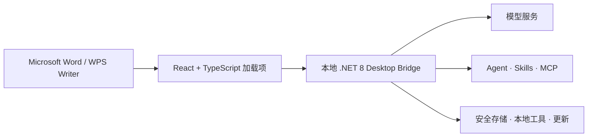

<p align="center">
  
</p>

<h1 align="center">WordOllama.JS</h1>

<p align="center">
  面向 Microsoft Word 与 WPS Writer 的本地优先 AI 工作空间。<br>
  一套 React 界面、一个跨平台 Desktop Bridge，自由选择模型。
</p>

<p align="center">
  <a href="README.md">English</a> · <strong>简体中文</strong>
</p>

<p align="center">
  <a href="LICENSE"></a>
  
  
  
  
</p>

<p align="center">
  <a href="https://wordollama.com">官方网站</a> ·
  <a href="docs/USER_GUIDE.zh-CN.md">用户指南</a> ·
  <a href="docs/WORD_MCP.zh-CN.md">外部 Word MCP</a> ·
  <a href="https://github.com/ByronLeeeee/wordollama.js/issues">问题反馈</a> ·
  <a href="CONTRIBUTING.md">参与贡献</a>
</p>

---

WordOllama.JS 将写作、审阅、翻译、文档自动化和 Agent 工作流带入 Word 与 WPS。
它既支持 Ollama、llama.cpp 等本地模型，也支持 OpenAI 兼容接口、Claude、Gemini
及用户配置的其他模型服务。

桌面版完全在用户本机自托管。.NET 8 Desktop Bridge 同时提供 React 界面和本地
API，并负责 Provider、MCP、Skills、本地工具、安全存储和更新验证。安装正式桌面包
后，最终用户不需要运行 Vite、打开终端或手动启动 Bridge。

> 需要旧 COM/VSTO 社区版？请访问
> [`wordollama-community`](https://github.com/ByronLeeeee/wordollama-community)。

## 功能亮点

| 领域 | 主要能力 |
| --- | --- |
| 写作与编辑 | 创作、润色、扩写、精简、续写、总结、校对、修改，以及可复用提示方案 |
| 翻译 | 带术语和风格控制的自由翻译 |
| 文档智能 | 图片理解、智能表格、Markdown、HTML、文档比较、结构化审阅与修订工作流 |
| 法务工作流 | 风险分析、公平审查、合同对比、法规检索、模拟法庭和文档审阅 |
| Agent | 计划、权限确认、检查点、长任务恢复、文档工具、来源卡片和用户反馈 |
| Skills 与 MCP | 内置 Skill 制作器、`/make-skill`、自定义 Skills、MCP 服务和带来源的外部检索 |
| 模型自由 | Ollama、通过 OpenAI 兼容接口接入 llama.cpp/LM Studio/vLLM，以及 OpenAI、Claude、Gemini |
| 本地优先安全 | 仅回环 Bridge、来源绑定会话、系统密钥库、默认拒绝工具、沙箱和签名更新门禁 |

所有提示词输入型功能都支持提示词优化，可先让模型完善用户的粗略指令，再执行任务。

## 架构



Windows 和 macOS 使用 `https://localhost:37421`。Linux WPS 使用仅绑定
`127.0.0.1` 的同源 HTTP，以避开内嵌浏览器的本地证书兼容问题。

## 平台支持

| 宿主 | 平台 | 状态 |
| --- | --- | --- |
| Microsoft 365 Word | Windows x64 | 支持 |
| Microsoft 365 Word | Apple Silicon macOS | 支持 |
| WPS Writer | Windows x64 | 支持 |
| WPS Writer | Apple Silicon macOS | 预览支持 |
| WPS Writer | Linux x64 | 预览支持 |
| Word 网页版 / Intel Mac | — | 桌面发行版不支持 |

旧版 Word 只显示其 Office.js requirement sets 能够支持的工具。不支持的能力会被
隐藏或返回明确提示，不会静默失败。

## 快速开始

安装桌面包、配置模型、注册 WPS 及各平台要求，请先阅读
[中文用户指南](docs/USER_GUIDE.zh-CN.md)。

开发环境需要 Node.js 24、.NET SDK 8 和 PowerShell 7：

```powershell
git clone https://github.com/ByronLeeeee/wordollama.js.git
cd wordollama.js

cd officejs/apps/addin
npm ci
npm run certs:install
cd ../../..

pwsh ./packaging/install-office-addin-dev.ps1
```

分别在两个终端启动 Bridge 和前端：

```powershell
dotnet run --project ./src/WordOllama.DesktopBridge/WordOllama.DesktopBridge.csproj
```

```powershell
cd officejs/apps/addin
npm run dev
```

重新启动 Word，然后打开 **WordOllama.JS** 功能区。

## 验证

执行完整本地回归：

```powershell
pwsh ./tools/unified-smoke-test.ps1 `
  -Configuration Release `
  -SkipManifestValidation
```

该门禁覆盖 TypeScript/Vite 构建、i18n、40 个 Word 工具、四档宿主能力、WPS
适配器、Agent、Provider、MCP、Skills、沙箱、更新门禁及真实 Bridge 重启恢复。
Windows 发布包生命周期回归为：

```powershell
pwsh ./tools/bridge-package-smoke-test.ps1 -Configuration Release
```

## 仓库结构

```text
officejs/   React 任务窗格、设置、Office.js/WPS 适配器和宿主测试
src/        .NET 协议、Agent/Provider 核心、MCP、平台代码和 Bridge
packaging/  Add-in、Bridge、Windows、macOS、Linux、签名和更新脚本
tools/      回归、安装包生命周期、密钥库和宿主凭据工具
docs/       用户指南、安全说明、架构方案和验收凭据
```

打包与发布命令见
[`packaging/README.zh-CN.md`](packaging/README.zh-CN.md)。

## 安全与隐私

WordOllama.JS 不运营开发者遥测服务。任务数据只会发送给用户自行配置的模型或外部
工具。可用时，凭据保存在 Windows Credential Manager、macOS Keychain 或 Linux
Secret Service 中。

使用在线模型处理敏感文档前，请阅读 [PRIVACY.md](PRIVACY.md)。安全漏洞请按照
[SECURITY.md](SECURITY.md) 私下报告；不要在公开 Issue 中提交密钥或私人文档。

## 参与贡献

欢迎贡献代码和文档。提交 PR 前请阅读 [CONTRIBUTING.md](CONTRIBUTING.md) 和
[CODE_OF_CONDUCT.md](CODE_OF_CONDUCT.md)。

## 联系方式

- 软件官网：[WordOllama.com](https://wordollama.com)
- 制作者：李伯阳 / Boyang Li
- 微信：`legal-lby`
- 邮件：[liboyang@lslby.com](mailto:liboyang@lslby.com)

## 开源许可

Copyright © 2026 李伯阳 / Boyang Li。

WordOllama.JS 是依据 [GPL-3.0-only](LICENSE) 发布的自由软件。对应源代码说明见
[SOURCE.md](SOURCE.md)，第三方组件声明见
[docs/THIRD-PARTY-NOTICES.md](docs/THIRD-PARTY-NOTICES.md)。
