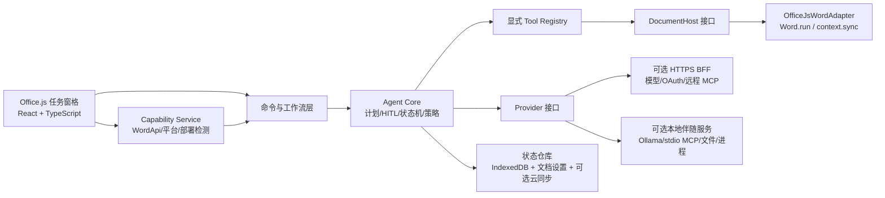

# WordOllama 从 VSTO 迁移到 Office.js 的评估与实施方案

> 版本：1.0  
> 评估日期：2026-07-22  
> 评估对象：当前仓库 `WordOllama` 社区版

> Windows/Mac 同一套产品、并尽可能保留现有能力的深化方案，见 [`OFFICE_JS_UNIFIED_DESKTOP_PLAN.zh-CN.md`](OFFICE_JS_UNIFIED_DESKTOP_PLAN.zh-CN.md)。

## 1. 结论先行

项目可以迁移到 Office.js，但不适合做“一次性、逐行翻译式”的全量重写。推荐采用“Office.js 跨平台核心 + 较新桌面 Word 增强 + 可选本地伴随服务”的分层架构，并让 VSTO 版本与 Office.js 版本并行一段时间。

迁移后的合理目标是：

- 在 Word 网页版、Windows、Mac 和 iPad 上提供任务窗格、选区问答、翻译/润色/续写、Agent 文档读写、批注、基础修订、图片、表格和审阅工作台。
- 在满足 `WordApiDesktop` 的较新 Windows/Mac Word 上额外提供页面设置、目录、修订明细等增强能力。
- 本地命令、Python、本地文件扫描、stdio MCP、Windows DPAPI、环境变量管理等能力保留在可选的本地伴随服务中；纯 Office.js 模式不提供这些系统权限。
- WPS 不纳入 Office.js 的承诺范围。Microsoft 官方列出的 Word Office Add-in 宿主是 Word 网页版、Windows、Mac 和 iPad，并不包含 WPS；如必须继续支持 WPS，应保留现有 VSTO/COM 版本，或另做 WPS JS 插件适配层。

因此，建议的产品定位不是“Office.js 完全取代 VSTO”，而是：

1. Office.js 成为面向 Microsoft Word 的主版本和跨平台版本。
2. VSTO 在过渡期继续覆盖 WPS、旧版 Office 和 Windows 深度本地能力。
3. 高权限本地功能从 Office 加载项中剥离为显式安装、最小权限的伴随服务。

## 2. 现状盘点

### 2.1 代码规模与耦合程度

本次静态盘点得到：

- 134 个 C# 文件，约 38,078 行 C#。
- 22 个 XAML 文件，约 3,612 行 XAML。
- 至少 34 个 C# 文件直接引用 Word Interop 或 `Globals.ThisAddIn`。
- 64 个文件涉及 WPF/Windows UI。
- 41 个内置 Agent 工具，外加动态 MCP 工具包装器。

这些数字包含生成代码，因此不能直接换算开发量，但足以说明迁移是架构重写，不是语言转译。

### 2.2 当前功能分层

| 层 | 当前实现 | 主要文件 |
|---|---|---|
| Office 宿主 | VSTO 生命周期、Ribbon、每窗口 CustomTaskPane、保存前事件 | `ThisAddIn.cs`、`Ribbon1.cs` |
| UI | WPF/WinForms 窗口、Agent/审阅任务窗格、设置和工具窗口 | `NewUI/`、`Forms/` |
| Agent | 计划确认、ReAct/原生 tool calling、HITL、检查点、权限策略 | `lib/DocumentAgent.cs`、`lib/IAgentTool.cs` |
| 文档工具 | 读取、搜索、替换、格式、批注、图片、表格、页面、法律工具 | `lib/Tools/` |
| 模型接入 | Ollama、OpenAI 兼容、Anthropic、Gemini、流式输出 | `lib/Providers/`、`OllamaFunctions.cs` |
| 扩展能力 | Skill、本地/远程 MCP、命令、Python、HTTP、文件检索 | `SkillManager.cs`、`McpBridge.cs`、`ExternalTools.cs` |
| 本地状态 | `%LocalAppData%` JSON、用户文档目录、DPAPI 密钥保护 | `AppConfig.cs`、`SecretProtector.cs`、设置 UI |

### 2.3 最重的迁移点

当前代码的几个核心假设在 Office.js 中不成立：

- COM `Range` 是同步、可长期持有的对象；Office.js 是代理对象和批处理模型，必须通过 `Word.run`、`load`、`context.sync()` 交互。
- VSTO 可访问操作系统；Office.js 运行在浏览器/WebView 沙箱中，不能直接启动进程、扫描任意目录、修改环境变量或使用 DPAPI。
- WPF 可以创建多个独立窗口和每 Word 窗口任务窗格；Office.js 的主要 UI 是 Web 任务窗格、Ribbon 命令和受限制的对话框。
- VSTO 可以订阅 `Application.DocumentBeforeSave`；Office.js 当前没有等价的 Word 保存前事件。Word 的事件激活目前主要是 `OnDocumentOpened`，并且有部署、平台、时长和并发限制。
- 当前文档对比会打开两个文件、调用 `CompareDocuments`、遍历/接受/拒绝修订并创建输出文档；Office.js 没有等价的 `Application.CompareDocuments` API。

## 3. Office.js 能力基线

Office Add-ins 本质上是由 HTTPS 托管的 Web 应用，使用 HTML/CSS/JavaScript 和 Office.js 与宿主交互；Microsoft 官方支持 Word 网页版、Windows、Mac 和 iPad。参见 [Office Add-ins 平台概览](https://learn.microsoft.com/en-us/office/dev/add-ins/overview/office-add-ins) 和 [Word Add-ins 文档](https://learn.microsoft.com/en-us/office/dev/add-ins/word/)。

截至本方案日期，稳定的跨平台编号要求集最高为 `WordApi 1.9`；另有只面向部分桌面客户端的 `WordApiDesktop 1.5`。不同版本和渠道的支持差异很大，必须运行时检测，不能以“安装了 Word”作为能力判断。详见 [Word JavaScript API requirement sets](https://learn.microsoft.com/en-us/javascript/api/requirement-sets/word/word-api-requirement-sets?view=word-js-preview)。

建议采用以下能力分级，而不是给整个加载项设置过高的最低版本：

| 能力级 | 运行时要求 | 用途 | 产品行为 |
|---|---|---|---|
| L0 基础 | `WordApi 1.1` | 文本、选区、搜索、段落、基础格式、表格、页眉页脚、OOXML | 加载项可安装并提供基础功能 |
| L1 审阅 | `WordApi 1.4` | 批注、变更跟踪模式、书签锚点 | 启用完整审阅/建议体验 |
| L2 跨平台增强 | `WordApi 1.5`–`1.9` | 按具体 API 渐进增强 | 单项 feature flag，不作为全局门槛 |
| L3 桌面增强 | `WordApiDesktop 1.3/1.4` | 页面设置、目录、修订集合等 | 只在受支持的较新 Windows/Mac Word 中显示 |
| R1 共享运行时 | `SharedRuntime 1.1` | Ribbon 与任务窗格共享状态、任务窗格关闭后继续运行、文档打开时初始化 | 支持时启用；iPad 等不支持平台使用降级生命周期 |

推荐首版使用 XML add-in-only manifest：基础要求只声明 `WordApi 1.1`，在代码中检测高阶能力并隐藏或降级相应功能。原因是 XML manifest 的生产和旧客户端覆盖更稳定；Unified manifest 可作为后续分发版本，但 Microsoft 仍建议在旧版或永久许可证用户存在时维护两种 manifest。参见 [Office Add-ins manifest](https://learn.microsoft.com/en-us/office/dev/add-ins/develop/add-in-manifests) 和 [双 manifest 维护说明](https://learn.microsoft.com/en-us/office/dev/add-ins/concepts/duplicate-legacy-metaos-add-ins)。

## 4. 功能迁移矩阵

### 4.1 Office UI 与常用 AI 功能

| 当前功能 | Office.js 方案 | 结论 |
|---|---|---|
| VSTO Ribbon 按钮、下拉框 | Add-in Commands；复杂动态选择移入任务窗格 | 可迁，Ribbon 需要简化 |
| Agent/审阅 CustomTaskPane | React/Web Components 任务窗格；共享运行时协调命令 | 可迁 |
| 多个 WPF 工具窗口 | 合并为任务窗格路由；必要时使用 Office Dialog API | 可迁但交互要重构 |
| 翻译、扩写、润色、简化、续写、摘要、自定义提示 | `document.getSelection()` + 模型调用 + `Range.insertText`/`insertComment` | 可迁 |
| 思维链独立窗格 | 改为任务详情/执行日志；不展示模型私有推理，仅展示可审计操作摘要 | 建议改版 |
| WebView2 HTML 预览 | 任务窗格内直接渲染并做 HTML sanitization | 可迁且可删除自建 WebView2 |
| 剪贴板导入 Markdown | 首选任务窗格粘贴区/文件选择；浏览器剪贴板仅在用户手势和权限允许时使用 | 降级迁移 |

### 4.2 Word 文档工具

| 工具组 | Office.js 映射 | 能力级 | 结论/注意事项 |
|---|---|---|---|
| 选区、全文、段落、语义地图 | `Document.getSelection()`、`Body`、`ParagraphCollection` | L0 | 可迁；大文档应分页读取 |
| 搜索、精确替换 | `Range.search()`、`insertText(..., "Replace")` | L0 | 可迁；必须处理重复命中和失效锚点 |
| 写入末尾、光标处插入 | `Body/Range.insertText`、`insertParagraph` | L0 | 可迁 |
| 样式、字体、段落、列表 | `Range.style`、`Font`、`ParagraphFormat`、`List` | L0/L2 | 大部分可迁，复杂版式需 OOXML 或降级 |
| 批注读取/新增 | `CommentCollection`、`Range.insertComment()` | L1 | 可迁；批注 API 为 `WordApi 1.4`，见 [Word.Comment](https://learn.microsoft.com/en-us/javascript/api/word/word.comment?view=word-js-preview) |
| 修订式写入 | 暂存并恢复 `Document.changeTrackingMode`，在单个事务中应用差异 | L1 | 可迁；跨平台使用 `changeTrackingMode`，不要依赖桌面专有 `trackRevisions` |
| 修订明细、接受/拒绝 | `RevisionCollection` 等 | L3 | 仅桌面增强；修订集合为 `WordApiDesktop 1.4` |
| 书签 | `Range.insertBookmark()`、`Document.getBookmarkRange*()` | L1 | 可迁；建议优先使用带 tag 的 content control 作为内部稳定锚点 |
| 图片插入 | `insertInlinePictureFromBase64()` | L0（1.2） | 可迁；API 从 `WordApi 1.2` 提供，见 [Word.Range](https://learn.microsoft.com/en-us/javascript/api/word/word.range?view=word-js-preview) |
| 基础表格读写、增行、改单元格 | `Table`、`TableRow`、`TableCell` | L0/L2 | 可迁；一次批量加载，避免逐格 `sync` |
| 页眉页脚 | `Section.getHeader/getFooter()` | L0 | 可迁；基础 API 从 `WordApi 1.1` 提供，见 [Word.Section](https://learn.microsoft.com/en-us/javascript/api/word/word.section) |
| 分页符 | `Range.insertBreak()` | L0 | 可迁 |
| 页面大小、方向、页边距 | `Document/Section.pageSetup` | L3 | 仅 `WordApiDesktop 1.3`，见 [Word.PageSetup](https://learn.microsoft.com/en-us/javascript/api/word/word.pagesetup?view=word-js-preview) |
| 目录创建/更新 | `TableOfContentsCollection` | L3 | 仅 `WordApiDesktop 1.4`，见 [Word.TableOfContentsCollection](https://learn.microsoft.com/en-us/javascript/api/word/word.tableofcontentscollection?view=word-js-preview)；跨平台可用 OOXML 试验性降级，但不承诺刷新一致性 |
| Markdown 转 Word | HTML 或 OOXML 插入，复杂样式使用受控 OOXML 生成器 | L0 | 可迁；需建立格式快照测试 |
| 法律文档读取、定义/交叉引用分析 | 纯文本算法 + 上述读取 API | L0 | 可迁 |
| 法律格式、风险高亮、插入条款 | 基础格式/搜索/批注/替换组合 | L0/L1/L3 | 主体可迁，页面级格式按能力降级 |

Office.js 已支持搜索、OOXML、HTML、Base64 docx 和图片插入等基础构件，详见 [Word.Range API](https://learn.microsoft.com/en-us/javascript/api/word/word.range?view=word-js-preview)。这些 API 能覆盖当前大多数“文档工具”，但调用方式、对象生命周期和性能模型都必须重写。

### 4.3 Agent、审阅与静默检查

| 当前能力 | 迁移设计 | 结论 |
|---|---|---|
| Agent 循环、tool schema、计划确认、HITL | 改写为与 Office 无关的 TypeScript core；UI 通过事件流订阅状态 | 可复用设计，代码需重写 |
| Agent 工具注册 | 显式工具清单 + capability predicate，禁止运行时反射扫描 | 可迁，且更利于 tree-shaking 和权限审计 |
| COM 主线程调度 | 替换为每工具一次 `Word.run` 事务和有限次数 `context.sync()` | 必须重写 |
| 执行前后段落快照 | 分块读取、hash/版本标记；大文档只抓相关区域和文档骨架 | 可迁 |
| 建议定位 | content control tag → bookmark → 段落索引+hash+摘录搜索 | 可迁；沿用现有多重回退思路 |
| 精确差异替换 | TypeScript diff 生成逆序 edit，再在一个 Word 事务内应用 | 可迁；必须验证格式和修订粒度 |
| 保存前静默审查 | 任务窗格打开时 debounce 检查、选区变化/显式“检查更改”触发；保存前触发无法等价实现 | 需产品降级 |
| 文档打开后初始化 | shared runtime auto-load，或 `OnDocumentOpened` 事件激活 | 部分可迁 |
| 断点恢复 | IndexedDB/服务端保存纯 JSON 状态；文档内只存任务 ID/版本 | 可迁 |

Word 当前的事件激活只提供有限事件，`OnDocumentOpened` 还受到管理员部署、平台、约 300 秒执行上限等约束，不能用来模拟常驻 VSTO 服务或保存前拦截。参见 [Activate add-ins with events](https://learn.microsoft.com/en-us/office/dev/add-ins/develop/event-based-activation)。Shared Runtime 可以让 Word 的 Ribbon 和任务窗格共享状态，并在支持的平台上延长运行时生命周期，但仍不应把它当作永久后台进程。参见 [Shared Runtime 配置](https://learn.microsoft.com/en-us/office/dev/add-ins/develop/configure-your-add-in-to-use-a-shared-runtime) 和 [支持矩阵](https://learn.microsoft.com/en-us/javascript/api/requirement-sets/common/shared-runtime-requirement-sets?view=word-js-preview)。

### 4.4 模型、MCP、Skill 与本地能力

| 当前能力 | 纯 Office.js | 后端/伴随服务方案 |
|---|---|---|
| OpenAI/Anthropic/Gemini/兼容 API | 浏览器 `fetch` 可实现，但受 CORS/CSP 限制，且不应在浏览器持久化长期 API Key | 推荐 BFF 代理、OAuth 或短期令牌 |
| Ollama/LM Studio 本机地址 | 桌面端可能通过 localhost 访问，但需要 CORS、Private Network Access、HTTPS/混合内容和企业策略验证；Word 网页版尤其不稳定 | 本地伴随服务做配对、来源校验和转发 |
| Streamable HTTP/SSE MCP | 满足 CORS 和认证时可以直连 | 推荐由 BFF/伴随服务统一执行和审计 |
| stdio MCP | 不可直接实现 | 必须使用本地伴随服务或远程 MCP 网关 |
| 命令、Python、任意 HTTP 工具 | 命令/Python 不可实现；HTTP 受浏览器策略限制 | 在服务端/伴随服务中按当前权限模型执行 |
| 本地文件 grep | 只能读取用户主动选择的文件，不能扫描任意目录 | 使用文件上传、File System Access 渐进增强或伴随服务 |
| 本地 Skill 目录自动扫描 | 不可实现 | 内置 Skill 打包；用户 Skill 通过导入、账号同步或伴随服务管理 |
| DPAPI 密钥保护 | 不可实现 | 云端密钥库/服务端会话；伴随服务使用 OS 密钥库 |
| OAuth localhost 回调 | 浏览器内不能启动 `HttpListener` | Office Dialog/Nested App Authentication/服务端 OAuth 回调 |

Office Add-ins 运行于 iframe/WebView 沙箱，应用逻辑通常由 HTTPS 托管。参见 [Office Add-ins 平台概览](https://learn.microsoft.com/en-us/office/dev/add-ins/overview/office-add-ins) 和 [Office Add-in 使用的浏览器/WebView](https://learn.microsoft.com/en-us/office/dev/add-ins/concepts/browsers-used-by-office-web-add-ins)。因此，本地高权限工具必须被视为单独产品组件，而不能伪装成 Office.js 前端能力。

## 5. 推荐目标架构



### 5.1 建议目录结构

```text
officejs/
  apps/addin/                 # task pane、commands、manifest、静态资源
  packages/agent-core/        # Agent 状态机、计划、HITL、上下文压缩
  packages/document-contract/ # DocumentHost 与纯 JSON DTO
  packages/word-adapter/      # Office.js 实现
  packages/tool-catalog/      # 文档工具、权限和 capability 声明
  packages/providers/         # provider 接口、流协议、错误规范化
  packages/ui/                # 任务窗格页面、审阅工作台、设置
  packages/shared/            # i18n、schema、日志脱敏、通用类型
  services/gateway/           # 可选 BFF
  services/companion/         # 可选 .NET 8 本地伴随服务
```

现有 `WordOllama/` VSTO 项目保留，直到 Office.js 版本达到退出门槛。不要在第一阶段直接删除或大改 VSTO 代码。

### 5.2 文档适配层原则

新增 `DocumentHost` 接口，使 Agent 永远不接触 `Word.Range` 或其他 Office.js 代理对象。建议最小接口按业务语义设计，例如：

```ts
interface DocumentHost {
  getSnapshot(options: SnapshotOptions): Promise<DocumentSnapshot>;
  getSelection(): Promise<LocatedText>;
  search(query: SearchQuery): Promise<LocatedText[]>;
  replace(locator: Locator, edits: TextEdit[], options: MutationOptions): Promise<MutationResult>;
  insertComment(locator: Locator, text: string): Promise<MutationResult>;
  applyFormat(locator: Locator, format: FormatSpec): Promise<MutationResult>;
}
```

关键约束：

- Office.js 代理对象不得离开创建它的 `Word.run` 回调。
- 每个工具调用是一个可审计事务；一次加载、一次变更、尽量一次 `sync`。
- 不按单段/单元格循环 `sync`，否则大文档性能会急剧下降。
- 所有写操作先重新定位并核对 hash，避免用户编辑后写错位置。
- 建议锚点使用带命名空间 tag 的 content control；需要无可见容器时再用 bookmark；最后回退到段落索引、hash 和摘录搜索。
- 变更跟踪模式必须先读取、在 `try/finally` 中恢复；不要修改用户原有审阅设置后遗留状态。
- UI、Agent、模型响应和 Office.js 错误统一使用可取消的异步流。

### 5.3 状态与密钥

状态分三类：

- 文档内状态：任务 ID、锚点 ID、schema 版本，可放 `Office.context.document.settings` 或自定义 XML；不要放 API Key。
- 本机非敏感状态：UI 偏好、最近模型、草稿，可放 IndexedDB。Office 官方指出 Add-in 运行环境近似无状态 WebView，跨文档状态宜使用用户身份和后端存储，参见 [Persist add-in state and settings](https://learn.microsoft.com/en-us/office/dev/add-ins/develop/persisting-add-in-state-and-settings)。
- 敏感状态：云端用服务端密钥库或 OAuth；本地模式由伴随服务调用 OS 密钥库。禁止把长期密钥写入 `localStorage`、IndexedDB、文档设置或日志。

现有 DPAPI 密钥不建议自动迁移。迁移工具只导出非敏感配置；API Key 由用户重新录入，或在受控企业部署中通过管理员配置注入。

## 6. 具体迁移阶段

### 阶段 0：冻结行为契约与 PoC（2–3 人周）

目标：先验证高风险点，再进入大规模开发。

交付：

- 保存当前 41 个内置工具的名称、参数 schema、结果和错误码，形成版本化契约。
- 准备 15–20 个 docx 金样本：中英文长文、复杂格式、表格、批注、修订、页眉页脚、法律合同。
- Office.js PoC 完成选区读取、搜索、批注、开启/恢复修订、精确差异替换、图片插入。
- 验证 content control/bookmark 锚点在用户继续编辑、保存、关闭重开后的定位成功率。
- 对 1,000/5,000 段文档做加载和变更性能测试。Windows Word 16.0.20228.20110（zh-CN）已于 2026-07-29 通过，原始报告见 `docs/evidence/windows-word-16.0.20228.20110-long-document-2026-07-29.json`；macOS 仍待实测。
- 实测目标网络环境下 Ollama、远程 API、CORS、企业代理和 Word 网页版行为。

退出条件：精确替换不会破坏未变文本格式；修订模式可可靠恢复；核心 API 在目标客户端矩阵通过。

### 阶段 1：Office.js 外壳与基础设施（3–4 人周）

交付：

- TypeScript 工程、XML manifest、Ribbon 命令、任务窗格和 Shared Runtime 渐进增强。
- Capability Service、错误边界、取消机制、i18n、主题和无障碍基础。
- `DocumentHost` 契约和 Office.js 适配器骨架。
- 单元测试、格式检查、manifest 校验和 CI 构建。

### 阶段 2：核心 AI 功能 MVP（6–8 人周）

交付：

- 选区翻译、扩写、润色、简化、续写、摘要、拼写修复、自定义提示。
- 插入、替换、批注、审阅窗格四种输出模式。
- 模型流式输出、停止、重试、超时、连接测试。
- 基础设置、非敏感配置导入、内置 Skill。
- 基础文档工具：读、搜、段落、替换、批注、格式、图片、表格、页眉页脚、分页符。

MVP 只承诺 Microsoft Word，不承诺 WPS、本地命令、stdio MCP、文档原生对比和保存前审查。

### 阶段 3：Agent 与审阅工作台（8–12 人周）

交付：

- TypeScript Agent Core、计划确认、HITL、权限模式、工具循环检测、上下文压缩和检查点。
- 显式工具目录及每工具 capability/side-effect 声明。
- 批量审阅建议、定位、接受/插入/批注/跳过、原文变更冲突确认。
- 法律文档工具和审查问题面板。
- 大文档分块、相关片段检索和文档快照增量更新。

### 阶段 4：Provider、远程 MCP 与生产安全（6–9 人周）

交付：

- BFF 或明确批准的直连模式；OpenAI/Anthropic/Gemini/Ollama 兼容协议。
- OAuth、短期令牌、CORS/CSP、域名 allowlist、日志脱敏和文档数据最小化。
- Streamable HTTP/SSE MCP；工具白名单、每次确认、信任级别和审计记录。
- Skill 导入/导出与可选账号同步。

### 阶段 5：桌面增强与本地伴随服务（可选，8–12 人周）

交付：

- `WordApiDesktop` 的页面设置、目录和修订明细。
- 本地伴随服务的安装、升级、进程生命周期、来源校验、一次性配对和健康检查。
- Ollama/LM Studio 可靠访问、stdio MCP、本地 Skill、受限文件检索、命令/Python。
- 沿用现有 `ToolExecutionPolicy` 的最小权限和逐次确认语义。

伴随服务不应默认安装或静默获取系统权限；每项高风险能力必须由用户显式开启。

### 阶段 6：兼容验证与发布（5–7 人周）

交付：

- Word 网页版、Windows Current Channel、Mac、iPad 的测试矩阵。
- `WordApi 1.1/1.4/1.9` 和 `WordApiDesktop 1.4` 的 capability 回归。Windows Word 16.0.20228.20110 已完成修订集合真实验收，报告见 `docs/evidence/windows-word-16.0.20228.20110-revisions-2026-07-29.json`；旧宿主显式降级已有自动化覆盖，macOS 仍待同一 runner 实测。
- 企业代理、离线、长文档、受保护文档、共同编辑、任务窗格关闭/重开测试。
- 管理中心集中部署、sideload、Marketplace 路径和隐私文档。
- 与 VSTO 并行发布、回退说明和支持手册。

## 7. 工期与人员估算

以下为人周，不是自然周；误差建议按 ±30% 管理。

| 目标 | 范围 | 估算 |
|---|---|---:|
| 技术验证版 | 阶段 0–1，证明核心 API 和架构 | 5–7 人周 |
| 可用 MVP | 再加阶段 2；常用 AI 和基础文档操作 | 累计 11–15 人周 |
| 跨平台生产版 | 阶段 0–4、6；Agent、审阅、远程 MCP、安全与发布 | 累计 30–43 人周 |
| 桌面近似功能版 | 加阶段 5；本地能力和桌面增强 | 累计 38–55 人周 |
| WPS 新适配层 | 在上述之外单独估算 | 额外 8–15 人周，且需先做 WPS API PoC |

推荐团队：2 名 TypeScript/Office.js 工程师、1 名熟悉现有 C#/Word COM 业务的工程师、0.5–1 名 QA/自动化。三人并行时，跨平台生产版约 4–5 个月；包含伴随服务、企业部署和充分兼容性回归时约 5–7 个月。

主要不确定性不是 UI，而是复杂格式保真、长文档性能、修订粒度、客户端要求集差异、企业网络下的本地模型访问，以及文档对比产品取舍。

## 8. 测试与验收

### 8.1 自动化分层

- Agent core：Vitest 单元测试，覆盖计划/HITL/循环/上下文压缩/权限策略。
- 工具契约：同一 fixture 对 VSTO 和 Office.js 输出规范化 JSON，比对行为而不是实现。
- Word adapter：mock `RequestContext` 做边界测试；关键流程必须在真实 Word 中验证。
- UI：Playwright 测任务窗格 Web UI；不要把它当作 Word 宿主 E2E 的替代品。
- 文档金样本：操作前后保存 docx，比较文本、样式、批注、修订和 OOXML 关键片段。
- 手工矩阵：Windows/Mac/Web/iPad、深浅主题、中文/英文、触控和键盘操作。

### 8.2 建议验收指标

- 常用 20 个文档工具在目标客户端成功率不低于 99%，失败必须无部分写入或可明确恢复。
- 100 页文档的首次骨架读取在目标桌面环境 P95 小于 2 秒；不默认上传全文。
- 精确替换不改变未命中 run 的字体、段落和列表属性。
- 所有写操作均显示目标、影响和权限等级；高风险外部工具默认关闭。
- 任务窗格关闭、网络中断或模型取消后，不遗留错误的修订模式、临时 content control 或未释放任务。
- 不在浏览器存储、文档、诊断包或日志中出现明文密钥。

## 9. 迁移和发布策略

### 9.1 并行而非大爆炸切换

- Office.js 使用新的 Add-in ID 和独立版本号。
- VSTO 进入维护模式，只接受严重 bug 和安全修复。
- 首先通过 Microsoft 365 管理中心向内部试点用户部署；稳定后再决定 Marketplace。
- 两个版本共同发布至少 2 个稳定版本周期，并统计功能缺口和客户端分布。
- 当 Microsoft Word 目标用户的核心流程达到验收线后，才停止 VSTO 的 Microsoft Word 新功能；WPS 支持仍单独决策。

### 9.2 配置迁移

- 提供 VSTO “导出非敏感设置”命令，输出带 schema version 的 JSON。
- Office.js 导入模型名称、地址、提示词、样式映射和非敏感 MCP 元数据。
- 不导出 DPAPI 密文、API Key、MCP header/environment secret；用户重新认证或录入。
- Skill 以 zip/目录选择方式显式导入，不自动扫描“我的文档”。

### 9.3 功能降级必须可见

任务窗格启动时构建 capability map，例如：

```ts
const capabilities = {
  review: Office.context.requirements.isSetSupported("WordApi", "1.4"),
  desktopLayout: Office.context.requirements.isSetSupported("WordApiDesktop", "1.3"),
  desktopReview: Office.context.requirements.isSetSupported("WordApiDesktop", "1.4"),
  sharedRuntime: Office.context.requirements.isSetSupported("SharedRuntime", "1.1"),
};
```

不支持的功能应隐藏或显示明确原因，不能在运行到一半时才抛出“不支持 API”。

## 10. 关键风险与对策

| 风险 | 级别 | 对策 |
|---|---|---|
| 误认为 Office.js 能 1:1 覆盖 COM | 高 | 以本方案矩阵冻结范围；不承诺保存前事件和原生文档对比 |
| Word 客户端要求集碎片化 | 高 | manifest 低门槛 + 运行时 capability + 真机矩阵 |
| 精确替换破坏复杂格式 | 高 | 逆序最小 edit、hash 校验、OOXML 金样本、事务失败不写 |
| 大文档 `sync` 次数过多 | 高 | 批量 load/write、分页、一次工具一次事务、性能预算 |
| 本地 Ollama/MCP 被 CORS/PNA/企业策略阻断 | 高 | 阶段 0 实测；生产提供伴随服务或远程网关 |
| 浏览器端密钥泄露 | 高 | 不持久化长期密钥；BFF/OAuth/OS 密钥库；CSP 和日志脱敏 |
| shared runtime 被当作后台服务 | 中 | 可恢复状态机；任务幂等；服务端检查点；关闭/重开测试 |
| WPS 用户流失 | 高 | VSTO 继续维护，或独立 WPS 插件项目；产品页面明确宿主范围 |
| 两套实现长期分叉 | 中 | 共享工具 schema、提示模板测试向量和文档 fixture；设定 VSTO 退出门槛 |

## 11. 建议的首个迭代

先安排一个两周技术冲刺，不直接移植全部 UI。只做以下七个垂直切片：

1. XML manifest、Ribbon 按钮、React 任务窗格和 capability 面板。
2. 读取选区并流式调用一个 OpenAI 兼容端点。
3. 对选区做最小 diff 替换，并启用/恢复 `changeTrackingMode`。
4. 插入和读取批注。
5. 用 content control/bookmark 保存建议锚点，用户继续编辑后仍能正确定位。
6. 读取 1,000/5,000 段文档骨架并记录 `load/sync` 性能。
7. 在 Windows Word、Word 网页版和 Mac Word 各跑一次；同时验证本地 Ollama 的 CORS/PNA 可行性。

冲刺结束后做一次 Go/No-Go：

- 若格式保真、修订和性能通过，按阶段 1–4推进跨平台主线。
- 若本地模型直连不稳定，立即把伴随服务或 BFF 纳入正式范围，不继续用前端绕过浏览器安全模型。
- 若 WPS 是不可放弃的合同要求，明确保留 VSTO，并把“Office.js 替换项目”改名为“Microsoft Word 跨平台版本项目”。

## 12. 最终建议

本项目迁移 Office.js 的业务价值明确：可去除 VSTO/.NET Framework/ClickOnce 依赖，并覆盖 Word 网页版、Mac 和 iPad。但技术上只能实现“核心体验跨平台 + 高阶能力分层”，不能在纯 Office.js 中复刻现有 Windows 系统权限。

推荐立项边界如下：

- 第一里程碑：11–15 人周完成可用 MVP。
- 第二里程碑：累计 30–43 人周达到跨平台生产版。
- 本地伴随服务作为单独可选工作包，不阻塞基础 Office.js 上线。
- VSTO 至少保留到 Office.js 生产版经过两个版本周期，并继续承担 WPS 和旧环境支持。
- 文档原生对比、保存前审查、stdio MCP 和系统工具从第一版跨平台承诺中移除，后续分别用服务端 diff、显式检查、本地伴随服务解决。

这条路线风险最低，也最容易在早期交付可见价值，同时避免为了追求名义上的“完全迁移”而把 Office.js 重新做成一个高权限 Windows 专用方案。
