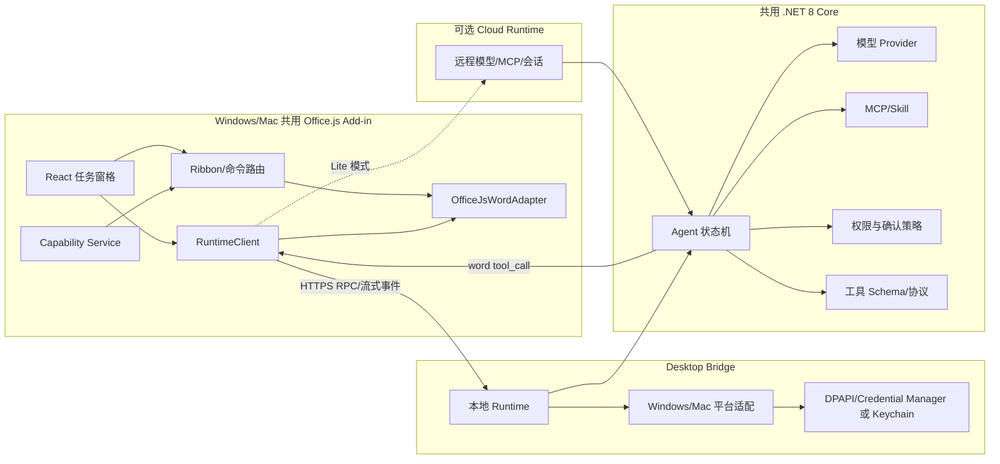

# WordOllama Windows/Mac 统一版实施方案

> 版本：1.0  
> 日期：2026-07-28
>
> 目标：Windows 与 macOS 使用同一套 Office.js 产品；以现有 WordOllama 源码为产品基准，尽可能保留当前 VSTO 版的能力、界面和用户工作流

## 0. 修正后的完成判定

迁移完成必须同时满足“底层能力等价”和“产品工作流等价”，不能再以工具注册数量、Bridge 端点或测试面板可用替代 UI 迁移：

1. `Ribbon1` 的分组、入口和状态能力都有 Office.js 对应入口或明确的 capability 降级。
2. `AgentTaskPaneUI` 的对话、问题、审阅、图片、命令、计划确认、权限、停止和结果处理形成完整闭环。
3. `NewSetting` 的 Provider、Ollama、Skill、MCP、Agent、Linter、Markdown、更新与关于设置可在统一版管理。
4. Writing、Translator、Law、MootCourt、Compare、HTML、TextToTable、ChatWithIMG、CustomPrompt 等独立工作流完成 Web 化或有明确等价入口。
5. Windows Word 与 macOS Word 均完成浅色/深色、中文/英文、窄任务窗格和关键交互真机验收。
6. `docs/OFFICE_JS_UI_PARITY_MATRIX.zh-CN.md` 中所有产品项达到“已迁移”后，才能宣称统一迁移完成。

底层 API 已存在但对应按钮、状态、错误恢复或逐项操作不可用时，该项仍视为未完成。

## 1. 定案

统一版应采用“双组件、单代码体系”，而不是纯前端 Office.js：

1. **WordOllama Office Add-in**：TypeScript Web UI + Office.js，Windows 与 Mac 共用，负责 Ribbon、任务窗格、Word 文档读取和写入。
2. **WordOllama Desktop Bridge**：跨平台 .NET 8 本地伴随服务，Windows 与 Mac 共用 Agent、Provider、MCP、Skill、权限和本地工具内核，只有密钥库、进程和安装方式使用平台适配器。

桌面完整模式把 Desktop Bridge 作为标准组件；未安装 Bridge 时进入 Lite 模式，仍可使用云端模型和基础 Word 功能。这样既能统一 Windows/Mac，又不会因为 Office.js 的浏览器沙箱丢失本地 Ollama、stdio MCP、Python、命令和文件检索。

统一版的含义是：

- 一套 Web UI。
- 一套 Office.js Word 工具实现。
- 一套 .NET 8 Agent/Provider/MCP 内核。
- 一套前后端 RPC 协议和工具 schema。
- Windows/Mac 只保留很薄的系统适配与安装差异。

它不意味着所有代码都改成 JavaScript，也不意味着每台机器只安装一个文件。

## 2. 产品运行模式

| 模式 | 组成 | 可用能力 | 目标用户 |
|---|---|---|---|
| Desktop Full | Office.js + Desktop Bridge | 当前核心能力、本地模型、全部 MCP transport、本地 Skill、受控系统工具 | Windows/Mac 主版本 |
| Desktop Lite | 仅 Office.js + 可选云端 Runtime | Word 文档工具、云模型、远程 HTTP/SSE MCP | 不允许安装本地服务的设备 |
| Web/iPad Lite | Office.js + 云端 Runtime | 跨平台基础功能，不提供本地系统权限 | 后续扩展 |
| Legacy | 原 VSTO | WPS、旧 Office、迁移期回退 | 维护模式 |

Microsoft 官方支持 Office Add-ins 在 Word 网页版、Windows、Mac 和 iPad 运行；加载项页面运行在浏览器/WebView 沙箱中，不能直接代替本地进程。参见 [Office Add-ins 平台概览](https://learn.microsoft.com/en-us/office/dev/add-ins/overview/office-add-ins)。

## 3. 目标架构



### 3.1 为什么 Agent 放在 .NET 8 Core

当前 `DocumentAgent`、Provider、MCP、Skill、Prompt、Diff 和权限策略都已经是 C#。虽然存在 `Globals.ThisAddIn`、COM 和 WPF 耦合，但将其抽成异步接口，比在 TypeScript 中重写两千多行 Agent 行为更容易保持兼容。

建议把 C# 拆为：

```text
src/
  WordOllama.Contracts/          # 工具 schema、DTO、错误码、RPC 协议
  WordOllama.Core/               # Agent、Prompt、Policy、Provider、Skill
  WordOllama.Mcp/                # stdio/HTTP/SSE MCP
  WordOllama.DesktopBridge/      # ASP.NET Core loopback runtime
  WordOllama.Platform.Windows/   # DPAPI、进程、路径、安装集成
  WordOllama.Platform.Mac/       # Keychain、进程、路径、launchd 集成
officejs/
  apps/addin/                    # manifest、commands、task pane
  packages/word-adapter/         # 35 个 Word 工具的 Office.js 实现
  packages/runtime-client/       # 本地/云端统一协议客户端
  packages/ui/                   # Agent、审阅、设置、工具页面
```

`WordOllama.Core` 和 `WordOllama.Mcp` 不允许引用 Interop、WPF、WinForms、注册表或 Windows 专用路径。

### 3.2 Agent 与 Word 工具的调用方式

Agent 不再直接持有 `Word.Document`。工具按执行位置分发：

| 工具类型 | 执行位置 | 示例 |
|---|---|---|
| Word 工具 | Office.js Add-in | `search_text`、`replace_paragraph`、`add_comment`、`insert_table` |
| 本地工具 | Desktop Bridge | `execute_command`、`run_python_script`、`grep` |
| MCP 工具 | Desktop Bridge 或 Cloud Runtime | stdio、Streamable HTTP、SSE |
| UI 工具 | Office.js Add-in | `ask_human`、计划确认、危险操作确认 |
| Core 工具 | .NET 8 Core | `read_skill`、纯文本法律分析、上下文压缩 |

调用链示例：

```text
Agent 选择 replace_paragraph
  → Core 发出 tool_call(id, name, params)
  → Add-in 在 Word.run 中重新定位目标并校验 hash
  → Office.js 应用最小差异和修订
  → Add-in 返回 tool_result(id, result)
  → Core 继续下一轮
```

Office.js 代理对象不得通过 RPC 传输。协议中只出现纯 JSON locator、文本、hash、版本和结果。

## 4. 当前能力如何保留

### 4.1 41 个内置 Agent 工具

现有工具名称和参数 schema 建议全部保留，避免现有 Prompt、Skill 和用户习惯失效。

| 分组 | 数量 | 处理方式 | 保留情况 |
|---|---:|---|---|
| Word 文档/格式/法律/页面/表格/图片工具 | 35 | 用 Office.js 重写执行器，schema 不变 | 名称和语义尽量 100% 保留 |
| 外部工具 | 4 | Desktop Bridge 执行 | Full 模式保留 |
| `read_skill` | 1 | .NET 8 Core/Bridge | 保留 |
| `ask_human` | 1 | Office.js UI | 保留 |

其中：

- `page_setup` 需要 `WordApiDesktop 1.3`。
- `update_toc` 和完整目录操作需要 `WordApiDesktop 1.4`。
- 批注、书签、修订式建议至少应以 `WordApi 1.4` 为完整体验基线。
- `Range.getTrackedChanges()` 已在跨平台 `WordApi 1.6` 提供；更完整的桌面 `RevisionCollection` 可作为增强。

当前官方支持矩阵显示 `WordApiDesktop 1.4` 已覆盖较新的 Windows 和 Mac Word，但不覆盖所有永久许可证版本。因此统一版建议把“完整支持”基线设为：

- Windows Microsoft 365：Version 2508 / Build 19127.20264 或更高。
- Mac Word：Version 16.100.4 或更高。
- 旧版本仍允许安装，但由 capability map 降级。

版本依据见 [Word JavaScript API requirement sets](https://learn.microsoft.com/en-us/javascript/api/requirement-sets/word/word-api-requirement-sets?view=word-js-preview)。

### 4.2 常用 AI、Agent 和审阅

| 当前能力 | 统一版处理 | 一致性 |
|---|---|---|
| 翻译、扩写、润色、简化、续写、摘要、自定义提示 | 同一 Web UI + 同一 Provider Core | 基本一致 |
| 流式输出、取消、重试、模型能力探测 | Core 流式事件传给任务窗格 | 基本一致 |
| Agent 计划确认、HITL、循环检测、检查点 | 从 `DocumentAgent` 抽出到 .NET 8 Core | 保留 |
| 查看/建议/直接执行三种模式 | Core Policy + Office.js 写入确认 | 保留 |
| 审阅建议接受、插入、批注、跳过 | Web 审阅工作台 + 稳定 locator | 保留 |
| 精确字符差异和修订 | DiffPlex/`TextDiffService` 留在 Core；Office.js 逆序应用 edit | 保留，需格式回归 |
| 多文档/多窗口 | 每个文档一个 session；Bridge 按 documentSessionId 隔离 | 保留语义 |
| 独立 WPF 窗口 | 合并为任务窗格路由和 Office Dialog | 功能保留，窗口形态变化 |

### 4.3 本地模型、Provider、MCP 与 Skill

| 当前能力 | Windows/Mac 统一实现 |
|---|---|
| Ollama、LM Studio、vLLM | Bridge 从本机发请求，不让 Office WebView 直接承担 localhost/CORS 兼容 |
| OpenAI、Anthropic、Gemini | Provider 代码抽入 Core；密钥由 OS Secret Store 管理 |
| stdio MCP | Bridge 使用平台进程适配器启动并管理子进程 |
| Streamable HTTP/SSE MCP | Core/MCP 共用实现；本地和远程配置使用同一 schema |
| 本地 Skill | Bridge 管理应用数据目录；UI 提供导入、启停、查看权限 |
| 命令/Python | Bridge 执行；Windows 用 PowerShell/cmd 策略，Mac 用明确 shell/可执行文件策略 |
| 文件 grep | Bridge 只允许已授权根目录，解析真实路径并防止软链接越界 |
| API Key | Windows 使用 DPAPI/Credential Manager；Mac 使用 Keychain |

Mac 上不能简单把 Windows 命令字符串交给 `/bin/sh`。`IProcessRunner` 应接受结构化参数：可执行文件、参数数组、工作目录、环境变量和超时；只有兼容旧配置时才使用 shell，并再次确认。

### 4.4 静默审查

Office.js 没有与 VSTO `DocumentBeforeSave` 等价的 Word 保存前事件，因此保留“静默审查体验”，不承诺完全相同的触发时点：

1. Shared Runtime 启动后记录文档快照。
2. `DocumentSelectionChanged`、任务窗格输入和显式文档操作将文档标记为可能变更。
3. 用户停止编辑后 debounce 触发附近段落检查。
4. 每隔数秒读取 `Document.saved`；从 `false` 变为 `true` 时执行保存后保底检查。
5. 提供明确的“保存/发送前检查”按钮和快捷键。

`Document.saved` 从 `WordApi 1.1` 提供。Shared Runtime 在受支持的 Windows/Mac Word 中可在任务窗格关闭后继续运行，但仍必须按可能被系统回收来设计。参见 [Shared Runtime](https://learn.microsoft.com/en-us/office/dev/add-ins/develop/configure-your-add-in-to-use-a-shared-runtime)。

### 4.5 文档对比

Office.js 没有 `Application.CompareDocuments` 的等价方法。统一版不能继续依赖 Windows Word COM，否则 Mac 的结果和 Windows 不一致。

建议定义 `IDocumentComparer`：

```csharp
public interface IDocumentComparer
{
    Task<ComparisonResult> CompareAsync(
        Stream originalDocx,
        Stream revisedDocx,
        ComparisonOptions options,
        CancellationToken cancellationToken);
}
```

实施分两层：

- 基础引擎：Bridge 使用 Open XML 解析段落、表格、标题和 run，结合现有 DiffPlex 生成结构化差异，再交给模型分析。Windows/Mac 结果一致，可覆盖当前“找出变化并分析”的主要用途。
- 精确红线引擎：如果必须生成接近 Word 原生 Compare 的完整修订文档，需要单独评估商业 DOCX 比较引擎或自研 OOXML redline。它应放在可替换模块/服务中，并单独处理许可证兼容。

迁移期 Windows VSTO 可以继续提供原生 Compare 作为 Legacy 功能，但统一版 UI 不应声称两种引擎结果完全相同。

## 5. Desktop Bridge 通信方案

### 5.1 协议

建议使用版本化 JSON RPC 语义，但承载采用 HTTPS `fetch` + 流式 NDJSON，先不依赖 WebSocket：

```text
GET  /v1/health
POST /v1/pair
POST /v1/sessions
POST /v1/sessions/{id}/commands
GET  /v1/sessions/{id}/events       # fetch 流式读取 NDJSON
POST /v1/sessions/{id}/tool-results
POST /v1/sessions/{id}/cancel
```

核心消息：

```ts
type RuntimeEvent =
  | { type: "text_delta"; sessionId: string; text: string }
  | { type: "tool_call"; sessionId: string; callId: string; name: string; params: unknown }
  | { type: "ask_human"; sessionId: string; question: string }
  | { type: "permission_request"; sessionId: string; request: PermissionRequest }
  | { type: "checkpoint"; sessionId: string; checkpoint: AgentCheckpoint }
  | { type: "completed" | "failed" | "cancelled"; sessionId: string; detail?: string };
```

同一协议由 Desktop Bridge 和 Cloud Runtime 实现，任务窗格只切换 endpoint，不切换业务代码。

### 5.2 回环网络

Office Add-in 内容应通过 HTTPS 提供；Office 桌面端分别使用 WebView2 和 WKWebView。参见 [Office Add-in 使用的浏览器/WebView](https://learn.microsoft.com/en-us/office/dev/add-ins/concepts/browsers-used-by-office-web-add-ins) 和 [Office Add-in 安全说明](https://learn.microsoft.com/en-us/office/dev/add-ins/outlook/privacy-and-security)。

生产版建议：

- Bridge 只监听 loopback，不监听局域网地址。
- 优先使用 `https://127.0.0.1:<固定端口>`。
- 安装时为当前设备生成独立证书并放入当前用户信任存储；严禁所有安装共享同一私钥。
- 如果产品不接受本地证书安装，则提供“云端中继 + 端到端会话加密”作为第二传输，不把不稳定的 HTTP localhost 当成唯一生产路径。
- HTTP loopback 只用于 PoC。现代浏览器正在增加 Local Network Access 权限和提示，行为仍受 WebView版本与企业策略影响，参见 [Local Network Access](https://developer.mozilla.org/en-US/docs/Web/Security/Defenses/Local_network_access)。

### 5.3 配对与权限

即使只监听 localhost，也必须防范其他网页和本机进程调用 Bridge：

- 严格校验 `Host`、`Origin` 和 CORS，只允许正式 Add-in 域名。
- 首次连接使用 Bridge UI 显示的一次性配对码。
- 配对后签发 8 小时 session token；Add-in 仅在同源存储中缓存 token 与到期时间，不保存配对码。新开的 Agent、翻译、审阅等独立窗格可复用会话，过期、协议不兼容、内容损坏或 Bridge 返回 401 时立即清除。
- 每个 Bridge session 强制绑定受信任的 Add-in origin 和 capability set；文档/Agent 状态另外按会话标识隔离。
- 高风险操作不能只相信 Agent；Bridge 发出 `permission_request`，必须由 Office.js UI 显示真实命令、路径、URL、MCP server/tool 后确认。
- 对命令参数中的 key/token/password 字段继续使用当前脱敏策略。
- 防止 DNS rebinding、端口抢占、重放和跨文档 session 混用。

## 6. 文档定位与一致性

统一版最容易出严重问题的是 Agent 等待模型期间用户继续编辑文档。建议 locator 结构：

```ts
interface Locator {
  documentSessionId: string;
  contentControlTag?: string;
  bookmarkName?: string;
  paragraphIndex?: number;
  start?: number;
  end?: number;
  originalHash: string;
  excerpt?: string;
  snapshotVersion: number;
}
```

定位顺序：

1. 带命名空间的 content control tag。
2. bookmark。
3. 原始 offset + hash。
4. 文本搜索并用上下文消歧。
5. 段落索引 + hash。
6. 仍不确定时禁止自动写入，要求用户重新选择。

所有 Office.js 工具遵守：

- 每个工具一个 `Word.run` 事务。
- `load` 后统一 `sync`，批量修改后统一 `sync`。
- 先定位和 hash 校验，再写入。
- 写入失败返回结构化错误，不让 Agent把部分成功当成完全成功。
- 修改修订模式、选择位置或临时锚点时必须 `try/finally` 恢复/清理。

## 7. 平台适配边界

```csharp
public interface IPlatformServices
{
    ISecretStore Secrets { get; }
    IProcessRunner Processes { get; }
    IPlatformPaths Paths { get; }
    IFileAuthorizationStore FileAuthorizations { get; }
    IDesktopNotifier Notifications { get; }
    IUpdateService Updates { get; }
}
```

| 能力 | Windows | macOS |
|---|---|---|
| 密钥 | DPAPI/Credential Manager | Keychain Services |
| 后台启动 | per-user startup/task | LaunchAgent |
| 安装包 | 签名 MSI/MSIX/EXE | Developer ID 签名并 notarize 的 `.pkg`/`.dmg` |
| 自动更新 | 签名更新包 | 签名、notarized 更新包 |
| 进程执行 | 结构化 PowerShell/可执行文件 | 结构化可执行文件；shell 明确授权 |
| 默认 Skill/配置目录 | LocalAppData | Application Support |
| 文件路径 | Windows path/重解析点防护 | POSIX path/符号链接和 sandbox 权限防护 |

Apple 对站外分发软件要求 Developer ID 签名并建议 notarization，参见 [Distributing software on macOS](https://developer.apple.com/macos/distribution/) 和 [Notarizing macOS software](https://developer.apple.com/documentation/security/notarizing-macos-software-before-distribution)。

## 8. 代码复用策略

| 当前模块 | 做法 | 预期复用 |
|---|---|---|
| PromptTemplateService、ProviderCompatibility、RequestPolicy | 去掉全局配置依赖后迁入 Core | 高 |
| OpenAI/Claude/Gemini Provider | 改成 `HttpClientFactory`、配置注入和统一流接口 | 中高 |
| DocumentAgent | 去掉 COM/WPF/Globals，工具改为异步 dispatcher | 中 |
| MCP Bridge/Manager | 命令启动抽象化，保留协议实现 | 中高 |
| SkillManager | 路径和存储抽象化 | 高 |
| ToolExecutionPolicy、ConfirmationManager | Core 负责策略，UI 负责最终确认 | 高 |
| TextDiffService、DiffPlex 流程 | 迁入 Core | 高 |
| 35 个 Word 工具 C# 实现 | 保留 schema/描述，执行逻辑用 TypeScript 重写 | 低 |
| WPF/XAML/Ribbon/ThisAddIn | 用 Web UI/manifest 重写 | 低 |
| DPAPI/AppConfig | 拆成跨平台配置和 `ISecretStore` | 中低 |

不要直接把原 .NET Framework 项目改 target framework 后继续堆条件编译。先创建干净的 `net8.0` Core，按依赖方向逐个搬运，并用行为测试证明一致。

## 9. 实施顺序

### 阶段 A：统一架构 Spike（3 周，6–8 人周）

必须同时在 Windows Word 和 Mac Word 验证：

1. 同一 Office.js manifest、Ribbon 和任务窗格。
2. Shared Runtime 生命周期。
3. Bridge HTTPS、证书、配对和流式响应。
4. 从 Core 调用 `search_text`、`replace_paragraph`、`add_comment` 三个 Word 工具。
5. 本地 Ollama 流式生成。
6. 启动一个 stdio MCP 并调用工具。
7. 保存状态变化检测和静默检查替代方案。
8. 两个 docx 的跨平台结构化 compare PoC。

任何一项只在 Windows 成功都不算通过。

### 阶段 B：抽取 .NET 8 Core（5–7 周，10–14 人周）

- 抽取 Contracts、Agent、Provider、Policy、Skill、MCP。
- 全部工具执行改成 async dispatcher。
- 清除 `Globals`、COM、Dispatcher、WPF 和静态配置依赖。
- 使用现有 smoke fixture 建立 VSTO/Core 行为对照。
- 实现 Windows/Mac `IPlatformServices`。

### 阶段 C：Office.js 文档层和统一 UI（6–8 周，14–20 人周）

- 重写 35 个 Word 工具。
- 完成聊天、Agent、审阅、设置和各工具页面。
- 完成 locator、修订、批注、格式、表格、图片、页眉页脚和 OOXML。
- capability map 和旧版降级。

### 阶段 D：完整本地能力和发布（4–6 周，10–15 人周）

- 外部工具、Skill、全部 MCP transport、密钥迁移流程。
- 文档比较基础引擎。
- Windows 签名安装包和 Mac 签名/notarized 安装包。
- 安全评审、长文档、断网、恢复、共同编辑和企业代理测试。

总体估算为 40–57 人周。3 名开发 + 1 名 QA 的现实工期约 5–7 个月；如果精确 DOCX 红线比较必须首发，另增加 4–8 人周或商业引擎采购/集成周期。

## 10. 发布与退场

建议按以下顺序发布：

1. 内部 Alpha：Windows/Mac 同时发布，Bridge 必装。
2. 邀请 Beta：测试 Desktop Full；记录 capability 和错误，不上传文档正文。
3. GA：Office.js + 两个平台 Bridge 安装包。
4. VSTO 对 Microsoft Word 进入只维护状态；至少保留两个稳定版本周期。
5. VSTO 长期只承担 WPS/旧 Office，是否停用单独决策。

Web 资源可即时更新，但 Desktop Bridge 更新必须签名、可回滚，并保证协议向后兼容至少一个大版本。Add-in 与 Bridge 握手时交换：

```json
{
  "protocolVersion": "1.0",
  "addinVersion": "1.3.0",
  "bridgeVersion": "1.2.4",
  "platform": "macOS",
  "capabilities": ["local-model", "stdio-mcp", "python", "file-search"]
}
```

## 11. 第一批架构决策

正式编码前需要冻结以下 ADR：

1. `ADR-001`：Agent Core 使用 .NET 8，不在 TypeScript 再实现一套。
2. `ADR-002`：所有 Word 文档操作只能通过 Office.js adapter。
3. `ADR-003`：Desktop Full 标准安装 Bridge，Lite 模式不承诺本地权限。
4. `ADR-004`：本地 RPC 默认 HTTPS + 每设备证书；HTTP 仅 PoC。
5. `ADR-005`：41 个工具名称/schema 保持兼容，执行位置可变化。
6. `ADR-006`：Windows/Mac 完整支持基线为 `WordApiDesktop 1.4`，旧版渐进降级。
7. `ADR-007`：静默审查改为变更 debounce + 保存状态检测，不宣称保存前拦截。
8. `ADR-008`：文档比较使用可替换 `IDocumentComparer`，不依赖 Windows COM。
9. `ADR-009`：高风险权限由 Core 判定、Add-in 展示、Bridge 执行，三层都做校验。

## 12. 最终建议

要做 Windows/Mac 统一版并尽可能保留当前能力，Desktop Bridge 不应继续被视为“以后再做的可选项”，而应从第一天进入架构和 Spike。否则项目开发到中途一定会在 Ollama、stdio MCP、Skill、本地文件、命令和密钥管理上再次分叉。

推荐的主线是：

- Office.js 统一 Word 和 UI。
- .NET 8 统一 Agent 和本地能力。
- RPC 统一两者。
- capability map 处理 Word 版本差异。
- VSTO 只保留为 WPS/旧环境兼容版本。

按这个结构，当前 41 个 Agent 工具都可以保留名称和总体语义；真正无法完全等价的主要是 VSTO 保存前事件、Word 原生文档对比实现和独立 WPF 窗口形态。前两项有明确替代方案，后一项只影响交互形态，不影响核心业务能力。

## 13. `office.js` 分支当前落地与验收记录

本分支已经建立可运行的第一版统一实现，且没有修改原 `WordOllama/` VSTO 工程：

- `officejs/apps/addin` 使用同一套 TypeScript Office.js 适配器，显式注册原有 35 个 Word 工具和 `ask_human`；manifest 安装基线为 `WordApi 1.1`，目录会按运行时 `WordApi`/`WordApiDesktop` 能力过滤高阶工具；Office.js 代理对象只在 `Word.run` 事务内使用。
- Ribbon 使用不同 `TaskpaneId` 将 Agent、创作、编辑翻译、文档审阅、法律工具、设置和诊断拆成独立窗格；同类命令共享容器并按 `surface`/`workflow` 切换，前端 bundle 与 Bridge 仍保持 Windows/Mac 单一实现。设置为整页配置中心，金样本与运行日志位于独立诊断窗格。
- `src/WordOllama.Contracts`、`WordOllama.Core`、`WordOllama.Mcp` 和 `src/WordOllama.DesktopBridge` 组成 net8.0 Bridge；Agent 事件、计划确认、权限确认、checkpoint、Provider chat/models、本地工具、Skill 和 MCP 都使用 JSON 协议。
- Provider 另提供 `/providers/chat/stream` NDJSON 流；Ollama 使用原生 NDJSON，OpenAI 兼容端点使用 SSE，Claude 使用 Messages SSE，Gemini 使用 `streamGenerateContent` SSE；无法流式化的兼容端点仍自动降级为单块完成事件。
- Provider 已覆盖 Ollama、OpenAI 兼容端点、Anthropic/Claude 和 Gemini/Google；MCP 已覆盖 stdio、Streamable HTTP 和旧版 SSE。HTTP/MCP 非回环地址强制 HTTPS。
- 本地命令采用结构化参数和可执行文件白名单；grep、Python、Skill reference 均检查真实路径并拒绝符号链接/目录越界；`http_request` 默认关闭且只允许 HTTPS。
- Bridge 已定义 `ISecretStore`/`PlatformPaths` 边界，并接入 `WordOllama.Platform`：Windows 读取 Credential Manager，macOS 读取 Keychain，非目标系统/托管部署再回退到环境变量；密钥不写入 JSON 配置。
- Bridge 发布输出携带内置 `contract-reviewer` Skill；首次启动只在授权 Skill 根目录缺少文件时提取，不覆盖用户版本。
- `tools/unified-smoke-test.ps1` 已验证 TypeScript 类型检查、36 个工具完整模拟 dispatch、四档 Word API/WordApiDesktop capability matrix、Vite production bundle、HTTPS/loopback 发布地址拒绝、`WordOllama.JS` Add-in ZIP/生产 manifest、.NET Bridge 构建、安全默认值和 Skill 复制；脚本会检查每个外部命令的退出码。Microsoft manifest 在线校验通过，目标平台包含 Windows、Mac、Web 和 iPad。
- 任务窗格已加入真实 Word “36 项宿主金样本”运行器：在明确确认后为一次性文档建立固定夹具，按宿主 capability 过滤，逐项隔离失败并导出含 Word 版本/平台的 JSON 报告；自动测试覆盖 36 项唯一性、能力过滤、失败隔离、夹具阻塞和中英文内置样式映射。
- Windows Word 16.0.20228.20110（zh-CN）已通过真正的 `WordOllama.JS` 标签完成 36/36 宿主金样本，报告归档于 `docs/evidence/windows-word-16.0.20228.20110-golden-2026-07-29.json`。首次运行暴露 WebView2 不支持 `window.prompt()`，现已用窗格内 HTML 对话框替代，并同时移除金样本对 `window.confirm()` 的依赖。
- 同一 Windows Word 宿主已完成 1,000/5,000 段真实长文档验收：两档的全文读取、末端分块、语义映射和模拟共同编辑插入后的稳定锚点重定位均通过，且所有单项低于 30 秒预算；报告归档于 `docs/evidence/windows-word-16.0.20228.20110-long-document-2026-07-29.json`。
- Windows Word 16.0.20228.20110 已通过可重复的 `WordApiDesktop 1.4` 修订真实运行器：读取、复合身份校验、定位、单项接受/拒绝、全部接受、文本保留/移除和修订模式恢复均通过；报告归档于 `docs/evidence/windows-word-16.0.20228.20110-revisions-2026-07-29.json`。同一 runner 的 mock 覆盖缺少要求集时的显式降级。
- `StructuralDocumentComparer.cs` 和 `/documents/compare` 已升级为 `structural-lcs-v2`：按段落/标题/表格单元格对齐，返回原/新位置、词级 edit、OOXML 位置与结构摘要，避免插入导致级联误报；任务窗格已提供双 DOCX 选择、预览和 JSON 导出。真实 DOCX fixture、协议序列化、认证 HTTP 调用及空载荷拒绝均已验证；结果仍明确为 approximate。
- `packaging/publish-bridge.ps1` 会检查 `dotnet publish` 退出码、清理精确版本目录、验证可执行文件与生产安全配置；正式 ZIP 只允许在目标 OS 生成，异平台 `-CrossBuildOnly` 只验证编译且不归档。`tools/bridge-package-smoke-test.ps1 -IncludeCrossBuilds` 已在 Windows 验证 win-x64 正式 ZIP 与两个 macOS runtime cross-build；macOS 正式包仍需在 Mac 上完成 Developer ID 签名与 notarization。
- `packaging/sign-bridge-release.ps1` 已加入 Windows Authenticode、macOS codesign/notarytool 和签后归档流程；Windows 会优先使用 PATH 中的 `signtool.exe`，否则自动发现最新 Windows 10 SDK x64 工具。本机已用当前用户信任的自签名代码签名证书完成一次不带时间戳的 `unified-smoke` Authenticode 签署、policy verification 和签后 ZIP 重建，证明 Windows 工具链闭环可用；自签名或无时间戳都只能由显式 smoke/test 开关生成，生产签名、安装器与终审强制 CA 签发叶证书及 RFC 3161 时间戳。macOS 生产入口同样强制 `Developer ID Application` 身份与 notary profile，并把 Apple 返回的 submission ID、Accepted 状态、完整公证日志哈希、签名 Authority/Team ID、Hardened Runtime、安全时间戳及签名后 ZIP SHA-256 固化为独立证据；终审要求同一版本/架构/ZIP 的证据并再次执行 Gatekeeper 评估。按 Apple 的自定义公证工作流，ZIP 可提交但不能直接 staple，裸命令行二进制也不能附票，因此当前自动更新 ZIP 使用在线票据和 `spctl` 验收，不伪造离线 stapling 结果。正式跨机器证书签名及 macOS notarization 仍需在对应发布机执行。
- 设置页已接入签名平台安装器的一键更新：只有生产索引中带当前 runtime、SHA-256、精确大小和发布者的 EXE/PKG 才显示安装入口。Bridge 每次操作重新获取索引，限制下载为 512 MB，下载过程中同步计算哈希；索引声明的发布者还必须与上一版签名安装器写入 Bridge 配置的固定发布者一致。Windows 使用 Authenticode 检查 CA 颁发者、RFC 3161 时间戳和精确 Subject，macOS 使用 `pkgutil --check-signature`、固定 Developer ID Installer Authority 和 `spctl --type install`，验证后才交给系统安装器；任何异常都会清理临时/最终下载文件。自动测试覆盖正确下载、错误哈希、缺失/不匹配发布者、真实平台对未签名文件的拒绝，以及端点未配对/未配置失败关闭。
- COM 与 Office.js 用户数据已完成产品级隔离：Bridge 配置、Agent 恢复点、更新缓存和 Skills 使用独立 `WordOllama.JS` 用户目录，Credential Manager/Keychain 使用 `WordOllama.JS/<name>` 命名空间。首次启动只复制旧 Bridge 的已知文件及旧 Skills，限制文件数、总大小和目录深度并拒绝链接；不移动或删除旧源，迁移标记完成后不再同步。旧密钥仅作缺失时的一次兼容读取并复制，安装器卸载只删除 JS 版密钥，避免设置页删除 Skill 或卸载 Bridge 时影响并存的 COM 版。
- 三个目标原生 CI runner 在打包后使用随机且进程唯一的测试键，分别对 Windows Credential Manager 或当前账户 macOS Keychain 执行真实 set/get/delete 往返，并在 `finally` 再次清理；这与随后执行的 Bridge live smoke 分离，使平台密钥库的删除实现不会被只覆盖写入/读取的 Agent 恢复测试掩盖。
- `packaging/package-macos-installer.ps1` 已补齐此前只写在计划中的 macOS 安装载体：以当前用户 Home 为唯一安装域，将已签名/公证的 Bridge 安装到 `~/Library/Application Support/WordOllama.JS/DesktopBridge`，维护版本指针并安装用户 LaunchAgent；可信 PFX 未配置时 launcher 安静退出，`provision-bridge-https.ps1` 完成 Keychain 写入后自动激活。PKG 使用独立 `Developer ID Installer` 身份，经 `productbuild` 签名、Apple 公证、日志校验、stapler staple/validate 和 `spctl --type install` 后生成与 Bridge ZIP 公证绑定的安装器证据。最终发布描述必须同时复核 Application 与 Installer 两条身份/公证链，并把 PKG 作为 `desktop-bridge-installer` 产物固化；Windows 干跑回归验证完整命令契约，真实 PKG 仍须在 Mac 发布机生成。
- macOS PKG 已包含不依赖 PowerShell 的原生用户卸载器和独立 en-US/zh-CN 消息资源。卸载器固定校验 `~/Library/Application Support/WordOllama.JS/DesktopBridge` 与用户 LaunchAgent 路径，通过实际可执行文件路径只停止归属本安装的 Bridge，删除专用 HTTPS Keychain 密钥、安装文件和 pkg receipt，同时保留 Provider/MCP/API Key 与用户设置，避免卸载意外等于清空账号。payload 回归会检查两种语言资源、路径边界、LaunchAgent bootout、进程归属、Keychain service 和 receipt 清理；真实 Mac 仍需执行交互与 `--yes` 两条卸载路径。
- macOS 两个目标原生 CI runner 不再只 cross-build Bridge：`smoke`/`test` 专用的 `-BuildUnsignedForTests` 会实际调用 `pkgbuild`/`productbuild` 生成无签名 PKG，用 `pkgutil --expand-full` 展开后检查完整 payload，再以目标系统 `/bin/sh -n`、`plutil` 和可执行位验证 launcher、postinstall、双语卸载器及 LaunchAgent；该开关在正式版本上不会放松 Developer ID、公证、stapling 或 Gatekeeper 门禁。Windows 当前只能验证干跑契约，下一次目标原生 CI 执行结果才是这条新增门禁的权威证据。
- `WordOllama.WindowsInstaller` 与 `packaging/package-windows-installer.ps1` 已补齐 Windows 用户安装载体：生成内嵌签名 Bridge ZIP 和独立 SHA-256 元数据的 .NET 8 自包含单文件 WinExe，安装到 `%LOCALAPPDATA%`，支持幂等重装、版本指针、Apps & Features 当前用户卸载登记、隐藏 Startup、自有进程停止及完整卸载；PFX 未配置时不反复启动，Credential Manager 配置完成后自动激活。生产 EXE 强制 CA 签发 Authenticode、精确 publisher 和 RFC 3161 时间戳，并生成与 Bridge ZIP 绑定的安装器证据；终审重新验证 EXE 哈希、证书/时间戳指纹并固化为 `desktop-bridge-installer`。自动回归已实际构建并在隔离目录两次安装和卸载 unsigned smoke 安装器；正式签名证据仍须发布证书环境生成。
- 更新客户端现已消费生产索引中的 `installers`，按当前 Windows/macOS runtime 优先提供经终审绑定的用户安装器，并仅对不含该字段的旧索引回退 Bridge ZIP；两类产物均要求 HTTPS、SHA-256、正大小和平台扩展名，当前 runtime 的重复条目会拒绝整个索引。React 更新页会明确区分“安装器”和“兼容包”，不再把生产 ZIP 误当成面向用户的安装入口。
- `production.appsettings.windows.template.json`、`production.appsettings.macos.template.json` 和 Bridge Kestrel 配置支持各平台回环 HTTPS PFX；发布脚本会把对应模板设为活动 `appsettings.json`，空密码可从 `WORDOLLAMA_HTTPS_CERTIFICATE_PASSWORD` 回退，证书缺失时拒绝启动。`package-addin.ps1` 分别强制托管 Add-in 的非回环 HTTPS origin 和 Bridge 的回环 HTTPS origin，在 Vite 构建时注入 Bridge URL，并拒绝生产 bundle 残留开发 HTTP 地址。
- `provision-bridge-https.ps1` 已补齐安装后的 PFX 配置闭环：验证私钥、有效期、SAN 同时匹配 `localhost`/`127.0.0.1` 及信任链，将 PFX 放入安装根目录，并调用 Bridge 的受限标准输入命令写入 Windows Credential Manager/macOS Keychain；生产 JSON 保持空密码。自动 smoke 使用临时自签名证书验证路径改写和无明文配置，真实平台信任链仍是发布门槛。
- 正式 HTTPS 配置可输出不可伪装为 smoke 的证据：Bridge 增加只返回密码“存在/不存在”的密钥库校验命令，配置脚本会在写入后读回确认；仅当信任链、SAN、密钥库和空 JSON 密码全部通过且未使用任何跳过开关时才写出证据 JSON。`finalize-unified-release.ps1` 是唯一生成 `releaseReady: true` 描述文件的入口，会在目标 OS 重新验证平台签名/发布者、证书证据、同版本 36/36 工具、长文档、修订、复杂合同、双客户端共同编辑、16 个独立任务窗格、设置 Office Dialog 及主题/语言/宽度报告，并拒绝早于构建或版本不一致的证据。补充宿主证据另由独立严格校验器检查两份合同 SHA-256、已应用修订数、两个可区分 Word 客户端、共享文档标识、16 个唯一窗格 ID、设置弹窗和明暗主题 × 中英文 × 窄宽窗格的全部 8 组用例；缺项、重复或匿名证据不能通过。生产更新索引也强制逐个引用三个 runtime 的终审描述文件，并复核归档路径、SHA-256 和大小；绕过终审的 unsigned 索引仅能通过显式测试开关生成。
- comparer v2 响应已在兼容旧 `style/location` 字段的同时增加原稿/修订稿各自的样式与结构位置；预览会明确显示位置迁移。自动回归覆盖表格前插后原单元格从 table 1 移到 table 2 的修改、标题样式变化、中间插段、重复段落和 2,100 段回退路径，避免把位置漂移误当成无上下文的文本差异。
- comparer v2 的新增项还携带原稿插入锚点；独立比较窗格已提供逐项勾选和一次性“以 Word 修订应用”。应用前强制确认当前文档是原稿副本，批次会重新验证唯一原文/锚点、按逆序处理同锚点新增、保留修订侧标题样式，并对表格单元格文本使用唯一精确搜索。表格结构新增/删除因 Office.js 无法可靠复现而明确禁用，只允许审阅，不用清空文本冒充结构删除。
- Bridge 发布参数已把 Add-in origin 和更新索引 URL 纳入同一安全校验：origin 必须是非回环 HTTPS 且写成唯一 CORS allowlist，更新索引非空时也必须是非回环 HTTPS；包 smoke 使用非默认发布域名验证产物，避免加载项自托管域名与固定 Bridge CORS 配置错配。Windows 签名流程还会对每个已签 PE 立即执行 Authenticode policy verification。
- `package-unified-release.ps1` 已作为加载项与 Bridge 的单一构建入口，在一次调用中复用同一生产 origin，并生成明确标记 `releaseReady: false` 的 unsigned build descriptor。Windows 已用非默认发布域名真实生成 Add-in ZIP、win-x64 self-contained ZIP 和描述文件，验证 manifest、Bridge CORS 与更新索引一致；描述文件列出的签名、可信 PFX 和真实 Word 宿主门槛完成前不能升级为发布证明。
- GitHub Actions 目标平台 CI 已覆盖 `windows-latest`/win-x64、`macos-15`/arm64 和 `macos-15-intel`/x64：先运行统一 smoke，再在每个目标 OS 原生执行 Bridge 包 smoke 与统一构建，上传的产物名称显式带 `unsigned` 且只保留 7 天。该 CI 用来证明目标原生打包，不替代 Developer ID、notarization 或真实 Word 宿主验收。
- Windows/macOS 发布和签后归档已统一为 ZIP 根目录载荷；`install-bridge-update.ps1` 强制合法版本号和 SHA-256，拒绝多可执行文件、深层/混合载荷及缺失配置，同时兼容旧 Mac 单层目录；`rollback-bridge.ps1` 已移除 Windows 路径假设。打包 smoke 已用真实 Windows self-contained ZIP 验证根目录安装、旧 Mac 结构规范化、错误哈希拒绝、双版本状态切换和回滚，并 cross-build 两种 macOS runtime。
- 安装/回滚会原子维护稳定 `current-version` 指针；Windows Startup 快捷方式与 macOS LaunchAgent 都通过固定 launcher 解析当前版本，升级无需重写启动项。Bridge 增加按用户单实例 mutex；隔离 smoke 已验证 Windows 快捷方式目标、模拟 Mac plist/shell launcher、注销清理和版本切换，真实双进程验证第二实例安全退出。

仍需在真实发布环境完成的门槛：macOS 目标 Word 版本的 36 项宿主金样本、长文档性能和修订运行器，以及 Windows/Mac 的真实双客户端共同编辑和目录 API capability 降级；正式 HTTPS 证书链与真实平台密钥库写入验收、Windows 签名、macOS Developer ID/notarization；真实复杂合同的 comparer v2 验证及类似原生修订的逐项接受/拒绝应用流程。Windows 当前 Word 版本的 36 项工具、1,000/5,000 段单客户端长文档及修订 API 已通过，但这些剩余项未实测前仍不能宣称与 VSTO 完全等价。
